### Sequential Execution (SAME_THREAD Specifications, SAME_THREAD Features)

```mermaid
gantt
    dateFormat HH
    axisFormat %H
    tickInterval 1hour
%%    start: milestone, 00, 0h
    A.test 1: active, 00, 01
    A.test 2: active, 01, 02
    B.test 1: active, 02, 03
    B.test 2: active, 03, 04
%%    serial execution time: milestone, 04, 0h
```

### CONCURRENT Specifications, CONCURRENT Features

### CONCURRENT Specifications, SAME_THREAD Features

```mermaid
gantt
    dateFormat HH
    axisFormat %H
    tickInterval 1hour
%%    start: milestone, 00, 0h
    A.test 1: active, 00, 01
    A.test 2: active, 01, 02
    B.test 1: active, 00, 01
    B.test 2: active, 01, 02
    serial execution time: milestone, 04, 0h
```

### SAME_THREAD Specifications, CONCURRENT Features

