# Introduction to parallel execution in Spock

In this part you will learn and
exercise [parallel execution](https://spockframework.org/spock/docs/2.3/parallel_execution.html) feature for Spock.

First, familiarize yourself with [tests](src/test/groovy) in this module.

## No parallelization

- Run tests `./gradlew --rerun-tasks :part1.0-introduction:test :part1.0-introduction:createTestsExecutionReport`
- Check [reports](build/reports/tests-execution/html/test.html)

## Parallel execution

- Enable parallel execution
  in [`SpockConfig.groovy`](src/test/resources/SpockConfig.groovy)

```groovy
runner {
    parallel {
        enabled true
    }
}
```

- Run tests `./gradlew --rerun-tasks :part1.0-introduction:test :part1.0-introduction:createTestsExecutionReport`
- Check [reports](build/reports/tests-execution/html/test.html)

## Execution modes

- two execution modes
    - `SAME_THREAD`
    - `CONCURRENT`
- defined
    - for specifications (test classes) by `runner.parallel.defaultSpecificationExecutionMode`
    - for features (tests methods) by `runner.parallel.defaultExecutionMode`

```groovy
import org.spockframework.runtime.model.parallel.ExecutionMode

runner {
    parallel {
        enabled true
        defaultSpecificationExecutionMode ExecutionMode.SAME_THREAD
        defaultExecutionMode ExecutionMode.SAME_THREAD
    }
}
```

### Sequential Execution (SAME_THREAD Specifications, SAME_THREAD Features)


- `runner.parallel.enabled=false`
- or

```groovy
import org.spockframework.runtime.model.parallel.ExecutionMode

runner {
    parallel {
        enabled true
        defaultSpecificationExecutionMode ExecutionMode.SAME_THREAD
        defaultExecutionMode ExecutionMode.SAME_THREAD
    }
}
```

### CONCURRENT Specifications, CONCURRENT Features



```groovy
import org.spockframework.runtime.model.parallel.ExecutionMode

runner {
    parallel {
        enabled true
        defaultSpecificationExecutionMode ExecutionMode.CONCURRENT
        defaultExecutionMode ExecutionMode.CONCURRENT
    }
}
```

### CONCURRENT Specifications, SAME_THREAD Features


```groovy
import org.spockframework.runtime.model.parallel.ExecutionMode

runner {
    parallel {
        enabled true
        defaultSpecificationExecutionMode ExecutionMode.CONCURRENT
        defaultExecutionMode ExecutionMode.SAME_THREAD
    }
}
```

### SAME_THREAD Specifications, CONCURRENT Features


```groovy
import org.spockframework.runtime.model.parallel.ExecutionMode

runner {
    parallel {
        enabled true
        defaultSpecificationExecutionMode ExecutionMode.SAME_THREAD
        defaultExecutionMode ExecutionMode.CONCURRENT
    }
}
```

## Isolated execution



- Enable parallel execution (concurrent features, concurrent specifications)
- Create a copy of class `A` and name it `C`
- Run tests `./gradlew --rerun-tasks :part1.0-introduction:test :part1.0-introduction:createTestsExecutionReport`
- Check [reports](build/reports/tests-execution/html/test.html)
- Add `@Isolated` (`spock.lang.Isolated`) annotation to `C` class
- Run test again `./gradlew --rerun-tasks :part1.0-introduction:test :part1.0-introduction:createTestsExecutionReport`
  and check [reports](build/reports/tests-execution/html/test.html)

## Parallel thread pool

Supported options:

- `dynamic(BigDecimal factor)`
- `dynamicWithReservedProcessors(BigDecimal factor, int reservedProcessors)`
- `fixed(int parallelism)`
- `custom(int parallelism, int minimumRunnable, int maxPoolSize, int corePoolSize, int keepAliveSeconds)` ([docs](https://spockframework.org/spock/javadoc/2.3/spock/config/ParallelConfiguration.html#custom(int,int,int,int,int)))

Default: `dynamicWithReservedProcessors(1.0, 2)`

Check number of available processors:

```sh
jshell print-available-processors.jsh
```

- Add test case to class `A`

```groovy
def "test 3"() {
    sleep SLEEP_DURATION

    expect:
    true

    where:
    data << (1..20)
}
```

- Remove class `C`

- Run
  tests `./gradlew --rerun-tasks :part1.0-introduction:test :part1.0-introduction:createTestsExecutionReport -PtotalTimeOfAllTests=false`
- Check [reports](build/reports/tests-execution/html/test.html)
- Configure a thread pool of your choice, run tests and check reports
- Randomize duration of tests. In test `test 3` replace `SLEEP_DURATION`
  with `org.apache.commons.lang3.RandomUtils.nextInt(50, 250)`. Run tests and check reports.

---

[home](../README.md)
