## Execution modes

There are two execution modes:
  - `SAME_THREAD`
  - `CONCURRENT`

defined:
  - for specifications (test classes) by `runner.parallel.defaultSpecificationExecutionMode`
  - for features (tests methods) by `runner.parallel.defaultExecutionMode`

Sample configuration:

```groovy
import org.spockframework.runtime.model.parallel.ExecutionMode

runner {
    parallel {
        enabled true
        defaultSpecificationExecutionMode ExecutionMode.SAME_THREAD
        defaultExecutionMode ExecutionMode.SAME_THREAD
    }
}
```


### Sequential Execution (SAME_THREAD Specifications, SAME_THREAD Features)



- Set

```groovy
runner {
    parallel {
        enabled false
    }
}
```

- or

```groovy
import org.spockframework.runtime.model.parallel.ExecutionMode

runner {
    parallel {
        enabled true
        defaultSpecificationExecutionMode ExecutionMode.SAME_THREAD
        defaultExecutionMode ExecutionMode.SAME_THREAD
    }
}
```

### CONCURRENT Specifications, CONCURRENT Features



- Set

```groovy
import org.spockframework.runtime.model.parallel.ExecutionMode

runner {
    parallel {
        enabled true
    }
}
```

- or

```groovy
import org.spockframework.runtime.model.parallel.ExecutionMode

runner {
    parallel {
        enabled true
        // ExecutionMode.CONCURRENT is a default value
        // of defaultSpecificationExecutionMode and defaultExecutionMode
        defaultSpecificationExecutionMode ExecutionMode.CONCURRENT
        defaultExecutionMode ExecutionMode.CONCURRENT
    }
}
```

### CONCURRENT Specifications, SAME_THREAD Features



- Set

```groovy
import org.spockframework.runtime.model.parallel.ExecutionMode

runner {
    parallel {
        enabled true
        defaultSpecificationExecutionMode ExecutionMode.CONCURRENT
        defaultExecutionMode ExecutionMode.SAME_THREAD
    }
}
```


### SAME_THREAD Specifications, CONCURRENT Features



- Set

```groovy
import org.spockframework.runtime.model.parallel.ExecutionMode

runner {
    parallel {
        enabled true
        defaultSpecificationExecutionMode ExecutionMode.SAME_THREAD
        defaultExecutionMode ExecutionMode.CONCURRENT
    }
}
```