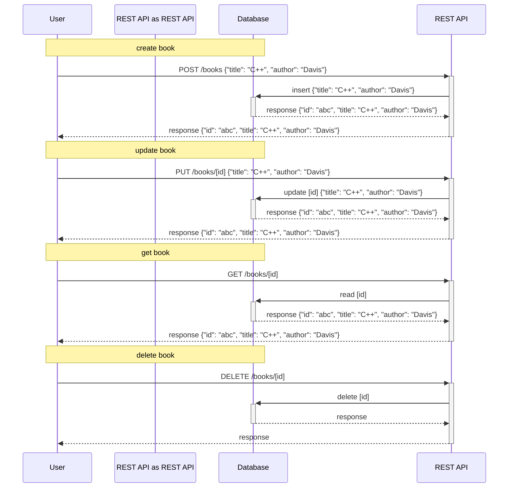

```mermaid
sequenceDiagram
    participant User as User
    participant REST API as REST API
    participant Database as Database
    Note over User, Database: create book
    User ->>+ REST API: POST /books {"title": "C++", "author": "Davis"}
    REST API ->>+ Database: insert {"title": "C++", "author": "Davis"}
    Database -->>- REST API: response {"id": "abc", "title": "C++", "author": "Davis"}
    REST API -->>- User: response {"id": "abc", "title": "C++", "author": "Davis"}
    Note over User, Database: update book
    User ->>+ REST API: PUT /books/[id] {"title": "C++", "author": "Davis"}
    REST API ->>+ Database: update [id] {"title": "C++", "author": "Davis"}
    Database -->>- REST API: response {"id": "abc", "title": "C++", "author": "Davis"}
    REST API -->>- User: response {"id": "abc", "title": "C++", "author": "Davis"}
    Note over User, Database: get book
    User ->>+ REST API: GET /books/[id]
    REST API ->>+ Database: read [id]
    Database -->>- REST API: response {"id": "abc", "title": "C++", "author": "Davis"}
    REST API -->>- User: response {"id": "abc", "title": "C++", "author": "Davis"}
    Note over User, Database: delete book
    User ->>+ REST API: DELETE /books/[id]
    REST API ->>+ Database: delete [id]
    Database -->>- REST API: response
    REST API -->>- User: response
```
