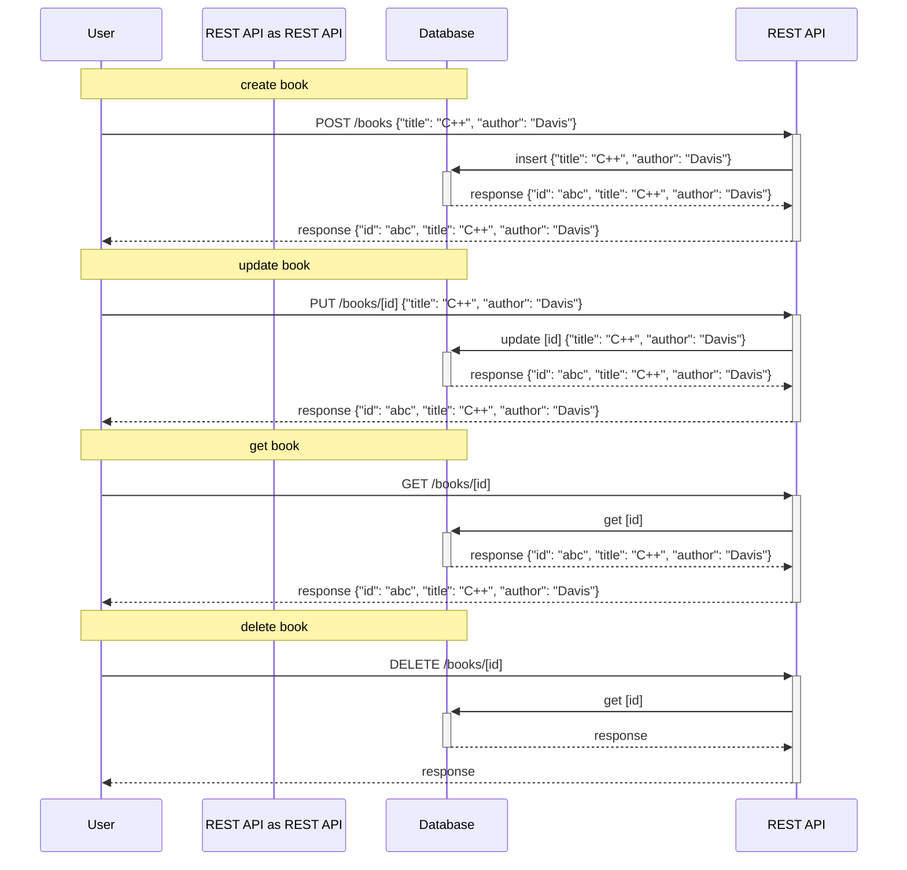

# Refactoring integration tests in an example REST service with a database

### Familiarize yourself with this service

Run service locally and check documentation.

1. Run MongoDB `docker run --rm -d -p 27017:27017 --name parallel-tests-mongo mongo:6.0`
2. Run the service `./gradlew bootRun` and go to [documentation](http://localhost:8080/swagger-ui/index.html)

Finally, you can stop and remove MongoDb container `docker stop parallel-tests-mongo`

### Refactor tests

1. Run tests `./gradlew --rerun-tasks :part2.1-database:test :part2.1-database:createTestsExecutionReport --continue`
2. Check [reports](build/reports/tests-execution/html/test.html)
3. Enable parallel execution (in [SpockConfig.groovy](src/test/resources/SpockConfig.groovy))
4. Run tests `./gradlew --rerun-tasks :part2.1-database:test :part2.1-database:createTestsExecutionReport --continue`
5. Determine and remove shared state.

#### Shared state

- unique index
- total number of documents in database

What to check?

- test setup/cleanup
- assertions

#### Final checks

- modify parallel thread pool e.g. `fixed(4)`
- add randomization using `@RandomizedOrder`

---
[home](../README.md)