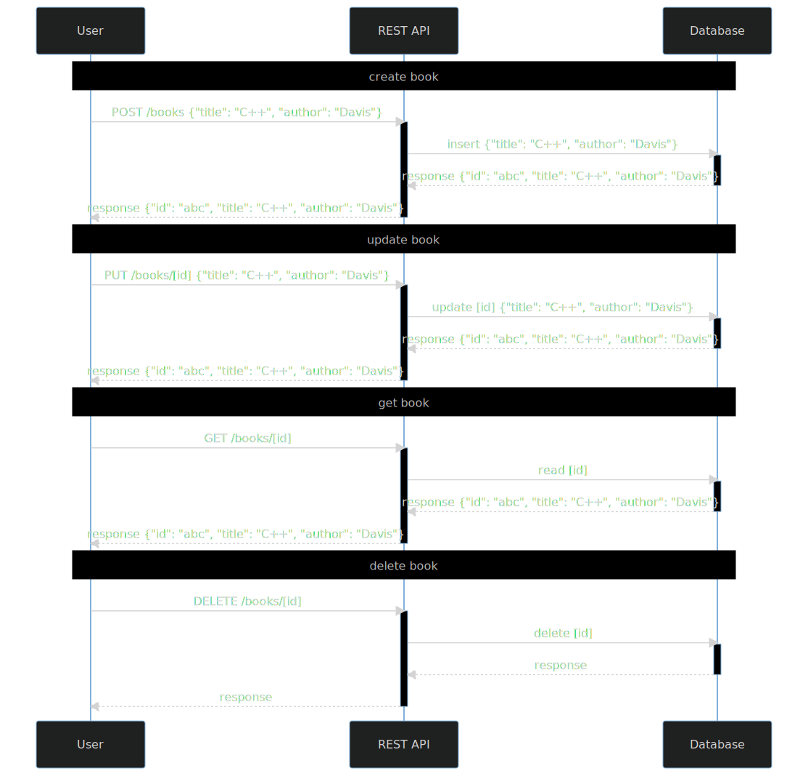

# Refactoring integration tests in an example REST service with a database

## Familiarize yourself with this service

Check [`tests`](src/test/groovy).

## Refactor tests

1. Run tests `./gradlew --rerun-tasks :part2.1-database:test :part2.1-database:createTestsExecutionReport --continue`
2. Check [reports](build/reports/tests-execution/html/test.html)
3. Enable parallel execution (in [SpockConfig.groovy](src/test/resources/SpockConfig.groovy))
4. Run tests `./gradlew --rerun-tasks :part2.1-database:test :part2.1-database:createTestsExecutionReport --continue`
5. Determine and remove shared state.

#### Shared state

- unique index
- total number of documents in database

What to check?

- test setup/cleanup
- assertions

#### Final checks

- modify parallel thread pool e.g. `fixed(4)`
- add randomization using `@RandomizedOrder` class annotation (add it to `*Test` class)

---
[home](../README.md)