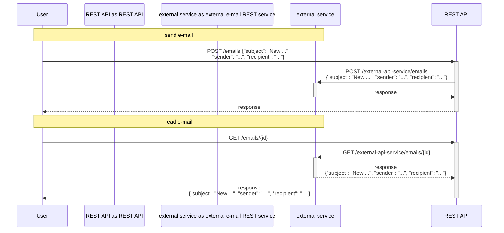

```mermaid
sequenceDiagram
    participant User as User
    participant REST API as REST API
    participant external service as external e-mail REST service
    Note over User, external service: send e-mail
    User ->>+ REST API: POST /emails {"subject": "New ...", <br/>"sender": "...", "recipient": "..."}
    REST API ->>+ external service: POST /external-api-service/emails <br/>{"subject": "New ...", "sender": "...", "recipient": "..."}
    external service -->>- REST API: response
    REST API -->>- User: response
    Note over User, external service: read e-mail
    User ->>+ REST API: GET /emails/{id}
    REST API ->>+ external service: GET /external-api-service/emails/{id}
    external service -->>- REST API: response <br/>{"subject": "New ...", "sender": "...", "recipient": "..."}
    REST API -->>- User: response <br/>{"subject": "New ...", "sender": "...", "recipient": "..."}
```

Convert to svg format

```shell
npx @mermaid-js/mermaid-cli mmdc -i part2.2-rest/.readme/sequence.md -o part2.2-rest/.readme/sequence.svg -t dark -b transparent
```