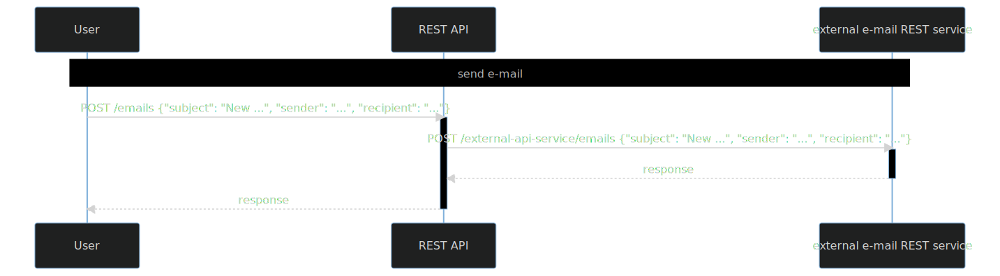

# Refactoring integration tests in an example  REST service with a REST dependency

### Familiarize yourself with this service

Check [`tests`](src/test/groovy).

### Refactor tests

1. Run tests `./gradlew --rerun-tasks :part2.2-rest:test :part2.2-rest:createTestsExecutionReport --continue`
2. Check [reports](build/reports/tests-execution/html/test.html)
3. Enable parallel execution (in [SpockConfig.groovy](src/test/resources/SpockConfig.groovy))
4. Run tests `./gradlew --rerun-tasks :part2.2-rest:test :part2.2-rest:createTestsExecutionReport --continue`
5. Temporarily disable test `retry email sending after error response ...` - add `@Ignore` annotation to method
   containing this test.
6. Determine and remove shared state.

#### Shared state

- stubs regarding REST dependency used in many tests (Wiremock state)

What to check?

- test setup/cleanup
- stubs (check Wiremock docs for [simulating fault](https://wiremock.org/docs/simulating-faults/) and
  for [stateful behaviour](https://wiremock.org/docs/stateful-behaviour/))
- assertions

#### Stateful Behaviour

One test is ignored. It uses scenarios. Read
about [stateful behaviour and scenarios](https://wiremock.org/docs/stateful-behaviour/). Enable this test and fix

---
[home](../README.md)