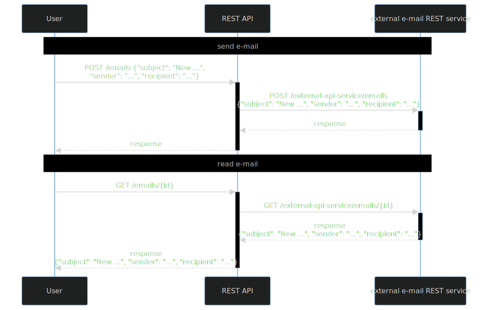

# Refactoring integration tests in an example  REST service with a REST dependency

### Familiarize yourself with this service

Run service locally and check documentation.

1. Run the service `./gradlew :part2.2-rest:bootRun` and go
   to [documentation](http://localhost:8080/swagger-ui/index.html)

### Refactor tests

1. Run tests `./gradlew --rerun-tasks :part2.2-rest:test :part2.2-rest:createTestsExecutionReport --continue`
2. Check [reports](build/reports/tests-execution/html/test.html)
3. Enable parallel execution (in [SpockConfig.groovy](src/test/resources/SpockConfig.groovy))
4. Run tests `./gradlew --rerun-tasks :part2.2-rest:test :part2.2-rest:createTestsExecutionReport --continue`
5. Determine and remove shared state.

#### Shared state

- stubs regarding REST dependency used in many tests (Wiremock state)

What to check?

- test setup/cleanup
- stubs (check Wiremock docs for [simulating fault](https://wiremock.org/docs/simulating-faults/) and
  for [stateful behaviour](https://wiremock.org/docs/stateful-behaviour/))
- assertions

---
[home](../README.md)