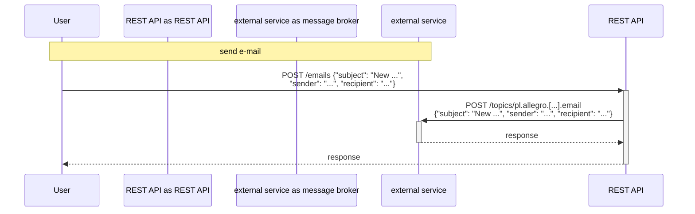

```mermaid
sequenceDiagram
    participant User as User
    participant REST API as REST API
    participant external service as message broker
    Note over User, external service: send e-mail
    User ->>+ REST API: POST /emails {"subject": "New ...", <br/>"sender": "...", "recipient": "..."}
    REST API ->>+ external service: POST /topics/pl.allegro.[...].email <br/>{"subject": "New ...", "sender": "...", "recipient": "..."}
    external service -->>- REST API: response
    REST API -->>- User: response
```
