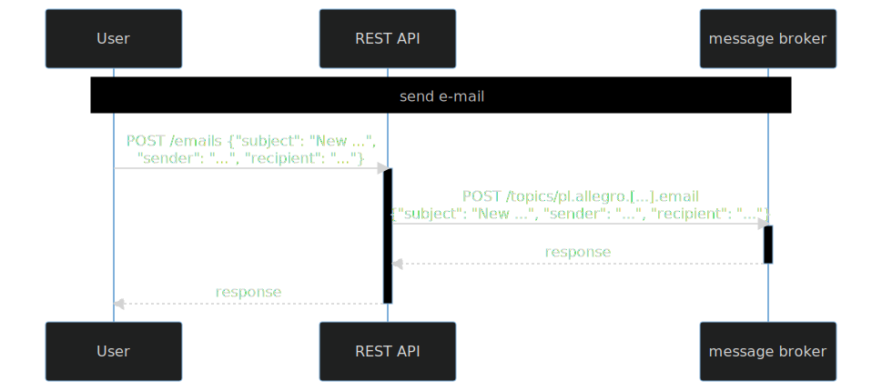

# Refactoring integration tests in an example REST service with a message broker

### Familiarize yourself with this service

Check [`tests`](src/test/groovy).

### Refactor tests

1. Run
   tests `./gradlew --rerun-tasks :part2.3-message-broker:test :part2.3-message-broker:createTestsExecutionReport --continue`
2. Check [reports](build/reports/tests-execution/html/test.html)
3. Enable parallel execution (in [SpockConfig.groovy](src/test/resources/SpockConfig.groovy))
4. Run
   tests `./gradlew --rerun-tasks :part2.3-message-broker:test :part2.3-message-broker:createTestsExecutionReport --continue`
5. Determine and remove shared state.

#### Shared state

- stubs regarding message broker (HermesMock state)

What to check?

- test setup/cleanup
- stubs (
  check [Hermes Mock documentation](https://hermes-pubsub.readthedocs.io/en/latest/user/hermes-mock/#hermesmockdefine))
- assertions (
  check [Hermes Mock documentation](https://hermes-pubsub.readthedocs.io/en/latest/user/hermes-mock/#hermesmockexpect))

---
[home](../README.md)